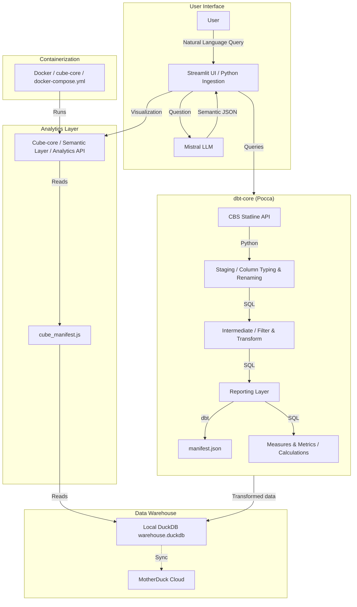

# Conversational Analytics

**Proof of Concept for AI-powered data analytics using natural language queries**

[](https://www.python.org/downloads/)

[](https://mistral.ai/)
[](https://github.com/dbt-labs/dbt-core)
[](https://github.com/cube-js/cube)
[](https://github.com/duckdb/duckdb)
[](https://github.com/streamlit/streamlit)

## Overview 

This Conversational Analytics POC enables users to query CBS (Dutch Central Bureau of Statistics) data using natural language. Initially, the system ingests CBS tables into a database, transforms them and adds context using dbt and pushes the total into a Cube semantic layer. 

Once the data warehouse is set and the semantic layer is in place, the user has to describe what data they are looking for. Based on the description, an LLM looks for the batch matching data source in the data warehouse. For accuracy the user has to confirm the suggested database, after which they can ask questions about the data. 

Each data question is first handled by an LLM, which checks whether the question concerns data (e.g. *How many suspected crimes happened in 2024?"*) or metadata (e.g. *"What is a crime?"*). The question is pushed through to the data warehouse, respectively the semantic layer, from which an answer is obtained. The result is then returned including the request sent to cube-core in json format.

## Architecture



### Step by Step

1. Ingesting data based on `registry.py` using [ingestion](ingestion/)
2. Transforming data in SQL using dbt based on [dbt_reporting](dbt_reporting/). Here, an ingested data source passes three stages: 
    a. **Staging layer**: Raw data cleaning and standardisation
    b. **Intermediate layer**: Business logic and data enrichment
    c. **Mart layer**: Analytics ready reporting models
3. 


## Components

| Component | Technology | Purpose |
|-----------|------------|---------|
| Ingestion | Python, cbsodata | ETL from CBS API to data warehouse |
| Warehouse | DuckDB, MotherDuck | Analytical data storage |
| Transformation | dbt-core | Data modeling and transformation |
| Semantic Layer | Cube-core | Metrics and dimensions abstraction |
| Interface | Streamlit | Conversational UI with LLM integration |
| LLM | Mistral AI | Connecting data to natural language |

## Project Structure

```readme
POC_ConversationalAnalytics/
├── ingestion/           # Data ingestion pipeline
│   ├── cbs_ingestion/   # CBS-specific ETL logic
│   └── duckdb/          # Database connections
├── pocca/              # dbt project (transformation)
│   ├── models/         # SQL models (staging, intermediate, marts)
│   └── dbt_project.yml
├── cube-core/          # Cube.js semantic layer
│   ├── model/          # Cube definitions
│   └── docker-compose.yml
└── poc-chatbot/        # Streamlit UI with LLM
├── app.py          # Main application
└── *.py            # LLM, query, and data source handlers

```

## Configuration

### Environment Variables

Create .env file:

```env

# Motherduck (Production)
MOTHERDUCK_TOKEN=your_token_here
MOTHERDUCK_DB=pocca

##LLM
MISTRAL_API_KEY=your_key_here

#Cube.js
CUBEJS_API_SECRET=your_key_here

```

## Available Datasets

- Haltjongeren (CBS 85993NED) - Youth referred to  a diversion programme for first time offenders
- Verdachten (CBS 20366NED) - Suspects data