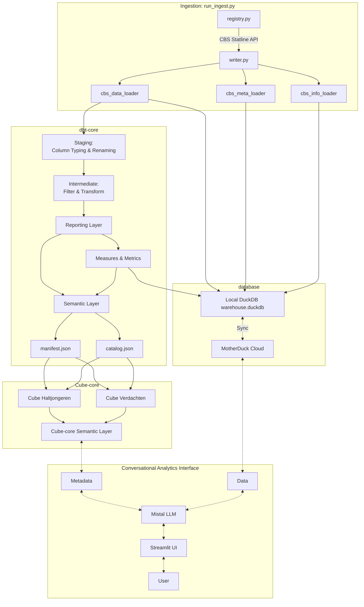

# Conversational Analytics

**Proof of Concept for AI-powered data analytics using natural language queries**

[](https://www.python.org/downloads/)
[](https://mistral.ai/)
[](https://github.com/dbt-labs/dbt-core)
[](https://github.com/cube-js/cube)
[](https://github.com/duckdb/duckdb)
[](https://github.com/streamlit/streamlit)

## Architecture



## Technical Highlights

### Architecture & Design Decisions

This proof of concept demonstrates a **modern, free of charge data stack** built entirely with open-source and free-tier tools:

| Component | Technology Choice | Rationale |
|-----------|------------------|-----------|
| **Data Ingestion** | Python + cbsodata | Direct API integration with CBS Statline, extensible for other sources |
| **Data Warehouse** | DuckDB (local) / MotherDuck (cloud) | Zero-config, embedded database with SQL support; MotherDuck for cloud sync |
| **Transformation** | dbt-core | Industry standard for data modeling, testing, and documentation |
| **Semantic Layer** | Cube-core | Open-source alternative to paid semantic layer tools |
| **LLM Integration** | Mistral AI | European-based LLM for natural language understanding |
| **Frontend** | Streamlit | Easy set up interface for conversational analytics |

### Data Governance Implementation

The pipeline addresses the following pillars of data governance:

1. **Data Quality**: Automated tests in dbt (`not_null`, `unique`, custom SQL tests)
2. **Data Stewardship**: Ownership defined in YML files per model
3. **Data Architecture**: Clear separation - raw → staging → intermediate → marts → semantic layer
4. **Metadata Management**: 
   - Column-level documentation in dbt YML files
   - Centralized term definitions in markdown
   - Lineage tracking through dbt's manifest.json

### Key Innovations

- **Costless Stack**: Entire pipeline runs on free tools (except Mistral API, which is replaceable by a free alternative)
- **Metadata-Driven**: Semantic models in dbt auto-synced to Cube-core using `dbt-cube-sync`
- **European-First**: Deliberate choice of Mistral AI (EU) and open-source over US-based LLMs and tools
- **Modular Design**: Each component (ingestion, dbt, cube, UI) can be swapped independently

### Challenges Solved

- **Hallucination Prevention**: Semantic layer ensures LLM queries map to validated, documented metrics
- **CBS API Complexity**: Abstracted behind clean Python ingestion layer with registry pattern
- **Schema Management**: DuckDB + dbt + Cube-core integration with consistent naming conventions

---
## Background & Motivation

As organisations seek to modernise their data stack, AI tools might often seem like a quick fix. However, attaching LLM's directly onto a data warehouse significantly increases the risk of hallucinations, resulting in unexplainable answers, diminished trust in data and in the end a lower level of data driven work within the organisation. This proof of concept serves to sell the possibilities of conversational analytics, as well as motivating data suppliers and consumers to engage in data governance initiatives. 

## Overview 

This Conversational Analytics POC enables users to query CBS (Dutch Central Bureau of Statistics) data using natural language. Initially, the system ingests CBS tables into a database, transforms them and adds context using dbt and pushes the total into a Cube semantic layer. 

Once the data warehouse is set and the semantic layer is in place, the user has to describe what data they are looking for. Based on the description, an LLM looks for the batch matching data source in the data warehouse. For accuracy the user has to confirm the suggested database, after which they can ask questions about the data. 

Each data question is first handled by an LLM, which checks whether the question concerns data (e.g. *How many suspected crimes happened in 2024?"*) or metadata (e.g. *"What is a crime?"*). The question is pushed through to the data warehouse, respectively the semantic layer, from which an answer is obtained. The result is then returned to the user through the LLM, including the request that was sent to cube-core in json format.

## Choice of Tools

There are several tools that provide the possibility of developing a conversational analytics tool with a governance-friendly backend, but these are either costly or significantly strengthen the dependency on a certain provider. With proof of concepts, one should be able to show a minimal viable product without having to ask for budget or permissions. Therefore, I developed this free pipeline to show the possibilities of conversational analytics, motivate for data governance and get discussions going to find out what is needed for implementing a similar, production grade solution. 

Ingestion is done through Python scripts and use the [Statline CBS API](https://www.cbs.nl/en-gb/our-services/open-data/statline-as-open-data). Data then is stored in a local duckdb warehouse and a cloud [MotherDuck](https://motherduck.com/) database. The latter remains free of charge as long as usage remains within the limits. Data transformation is done within [dbt core](https://github.com/dbt-labs/dbt-core). As the semantic layer in dbt is only available through the paid dbt cloud service, [cube-core](https://cube.dev/product/cube-core) is used to develop a semantic layer based on the semantic models within dbt. The python package [dbt-cube-sync](https://pypi.org/project/dbt-cube-sync/) takes care of the transformation from dbt to cube. Cube, as well as the frontend built in [Streamlit](https://streamlit.io/), are hosted on free environments in [Render](https://render.com/). The downside of Render is the startup time of the applications, but are acceptable for proof of concepts. 

### European Alternatives
The only paid part in this repository is the LLM, which is from a paid [Mistral](https://mistral.ai/) subscription. This decision was made deliberately in order to build more European. For data storage, [STACKIT](https://stackit.com/en) was considered as an alternative to duckdb / MotherDuck, but was not accessible at the moment of building due to their business-oriented model. European alternatives to cube-core and dbt-core are hard to find. However, given the fact that they are open source they suffice for the goal of this project. 


---


## Data Governance Approach
Trust comes by foot and leaves by horse. Therefore, it is absolutely crucial to have a solid data governance in place at the foundation of any data product. Data governance is built on several key pillars, amongst others:

1. **Data Quality**: Data should be accurate, consistent and reliable. 
2. **Data Stewardship**: It needs to be clear who is responsible for the data, so that bugs and issues can be solved quickly without consumers losing trust in data. 
  a. *Users* are mainly responsible for metrics, as they define the definition of the metrics they need.
  b.  *Providers* are responsible for the data sources. 
3. **Data Architecture**: The structure, storage and integration of data systems should be clearly defined. This prevents the same data living in multiple places and allows for a Single Source of Truth (SSOT). 
4. **Metadata Management**: Data needs to be clearly documented. For clarity and traceability, it is important that lineage and the relationships between tables are clearly defined. 

This pipeline provides an answer to each of the points above. A clear architecture makes the flow of data visible, from loading data via an API in [ingestion](/ingestion/) to transforming data in staging, intermediate marts and metrics in [pocca](/pocca/). In each step of the transformation, it is visible where the data comes from and what transformation steps have been performed. 

Within [pocca](/pocca/), the metadata is managed as well. From staging onwards, each table has an accompanying `.yml` file in which the definition of each table and column is documented. To prevent double work, the definitions are saved in `.md` files that contain all terms related to a certain model, e.g. Haltjongeren. In semantic models, there is even a bit more context behind the terms: how are Haltjongeren actually measured, and what is the difference between a crime and an offence? General definitions, e.g. for dimensions, are stored separately and can be reused for different models at the same time. 

[Pocca](/pocca/) takes care of the data quality aspect as well: each `.yml` file performs tests to guarantee the accuracy, consistency and reliability of the data. This includes standard tests, such as `not_null`, but can also contain custom tests that compare tables which each other. These custom tests are saved in [/pocca/tests](/pocca/tests/) and often use [macros](/pocca/macros/) for scalability. 

Within the `yml` files of each model, the owner is also specified. In case there are any issues or unclarities, the owner can quickly be found and contacted to help develop a sustainable solution. By being quickly able to track down an issue, work towards an issue and communicate promptly about the latest status, the user's trust in the data will stay on par and perhaps increase in the long term. 

### Motivation for Governance

Setting up a solid data governance policy solidifies the trustworthiness of data, increases adoption and enhances data driven decision-making. However, the road towards data governance can be time -consuming and frustrating at times. How do you convince data users and suppliers to spend time defining definitions and going through data alerts? 

This proof of concept aims to show users and providers the added value of data governance by showing the fruits of the efforts directly. Users can quickly get the insights they need and get a better understanding of the context without having to schedule calls with data professionals. Data suppliers, on the other hand, get less ad-hoc requests and get more peace of mind by knowing that the data they handed over is interpreted as it was supposed to be due to the additional context. An extra synergy is that the organisation and data grown closer together due to the fact that they speak the same language based on the conversational analytics tool. 

---

## Quick Setup for Reviewers

To explore the codebase and see the pipeline in action:

```bash
# 1. Clone and install dependencies
git clone https://github.com/your-username/ConversationalAnalytics.git
cd ConversationalAnalytics
python -m venv .venv
source .venv/bin/activate  # or .\.venv\Scripts\activate on Windows
pip install -r requirements.txt dbt-core dbt-duckdb

# 2. Ingest sample CBS data
cd ingestion
pocca-ingest --db dev --list  # See available datasets
pocca-ingest --db dev        # Load all to local DuckDB

# 3. Transform with dbt
cd ../pocca
dbt build --target dev

# 4. Start semantic layer (requires Docker)
cd ../cube-core
dbt-cube-sync dbt-to-cube 
  --manifest ../pocca/target/manifest.json 
  --catalog ../pocca/target/catalog.json --output ./model/cubes
docker-compose up -d
# Access Cube UI at http://localhost:4000
```

> **Note**: Full LLM integration requires Mistral API key. For code review, steps 1-3 demonstrate the complete ETL pipeline.

---

## Project Structure

```readme
POC_ConversationalAnalytics/
├── ingestion/                # Data ingestion pipeline
│   ├── cbs_ingestion/        
│   └── duckdb/               
├── pocca/                    # dbt project (transformation)
│   ├── models/         
|   │   └── docs/           
|   │   └── time_spine/     
|   │   └── staging/    
|   │   └── intermediate/
|   │   └── marts/
|   │   └── semantic_models/
│   └── dbt_project.yml
│   └── packages.yml
│   └── macros/
│   └── seeds/   
│   └── tests/           
├── cube-core/                # Cube.js semantic layer
│   └── cube.js
│   └── docker-compose.yml
│   └── Dockerfile
│   └── requirements.txt
│   ├── model/          
└── poc-chatbot/              # Streamlit UI with LLM

```
---

## Available Datasets

- Haltjongeren (CBS 85993NED) - Youth referred to a diversion programme for first time offenders
- Verdachten (CBS 20366NED) - Suspects data on youth, including the offence that they are a suspect off