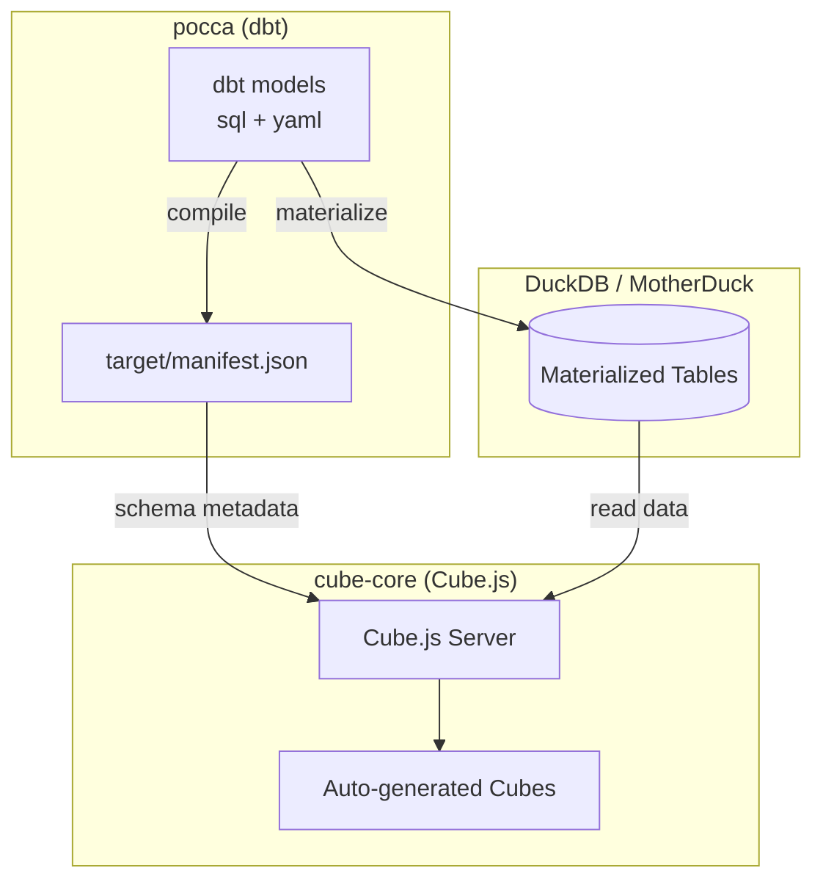

# Cube Core - Conversational Analytics

**Cube.js OLAP layer** is built on top of the [pocca dbt project](../pocca/README.md). It shows all the semantic models in dbt-core as **analytical cubes**, which are used by an LLM to communicate with in the conversational analytics application. 

## Architecture

## Quick Start

### Prerequisites

- Docker & Docker Compose
- `pocca` dbt project compiled: `cd ../pocca` + `dbt compile`

### Setup

#### dev

A minimal `cube.js` file is required to start the cube-core environment, displayed on [localhost:4000](http://localhost:4000/). Establish that the duckdb-driver is required (or any other database that you use), indicate that `devServer = true` to prevent cube-core from running in production mode, and let cube-core know where the database is located. Set the path to the database as a variable in your `docker-compose.yml` file. 
 
Develop the `docker-compose.yml` further by specifying the minimal requirements for deploying cube-core in a docker container. Essential in the environment are the database type and the path to the local database. The path of `CUBEJS_DB_DUCKDB_DATABASE_PATH` is based on the mounted location, which is established by defining `../data/duckdb:/data` under volumes.

After that, write the `dockerfile` to make sure the necessary things are installed, such as python and the packages specified in `requirements.txt`. Then install all items specified in `package.json` and copy all files required towards the docker container, except for the specified items in `.dockerignore`. 

