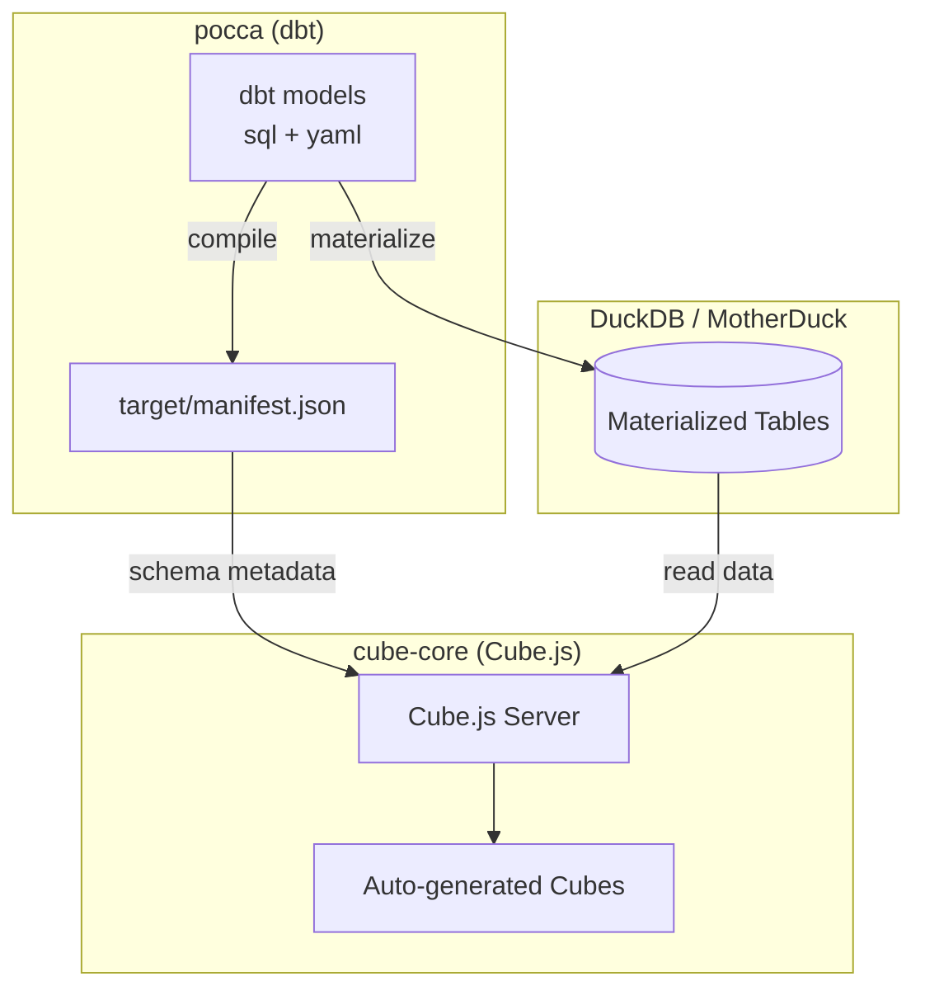

# Cube Core - Conversational Analytics

**Cube-core** is built on top of the [pocca dbt project](../pocca/README.md). It shows all the semantic models in dbt-core as **analytical cubes**, which are used by an LLM to communicate with in the conversational analytics application. 

## Architecture



## Quick Start

### Prerequisites

- Docker & Docker Compose
- `pocca` dbt project compiled: `cd ../pocca` + `dbt compile`

### Setup

#### Development

A minimal `cube.js` file is required to start the cube-core environment, displayed on [localhost:4000](http://localhost:4000/). Establish that the duckdb-driver is required (or any other database that you use), indicate that `devServer = true` to prevent cube-core from running in production mode, and let cube-core know where the database is located. Set the path to the database as a variable in your `docker-compose.yml` file. Set the variable `DEVSERVER` to `true` in your `docker-compose.yml` file, but leave it out of your environment variables on Render. In this way, you can access the cube-core UI on localhost and automatically set cube-core to production in Render.

```js
const { DuckDBDriver } = require('@cubejs-backend/duckdb-driver');

module.exports = {
  devServer: process.env.DEVSERVER === 'true',
  driverFactory: () => new DuckDBDriver({
    database: process.env.CUBEJS_DB_DUCKDB_DATABASE_PATH,
  }),
};
```
 
Develop the `docker-compose.yml` further by specifying the minimal requirements for deploying cube-core in a docker container. Essential in the environment are the database type and the path to the local database. The path of `CUBEJS_DB_DUCKDB_DATABASE_PATH` is based on the mounted location, which is established by defining `../data/duckdb:/data` under volumes.

After that, write the `dockerfile` to make sure the necessary things are installed, such as python and the packages specified in `requirements.txt`. Then install all items specified in `package.json` and copy all files required towards the docker container, except for the specified items in `.dockerignore`. 

Define your cube models in `model/cubes`. You can do this either manually, or you can ingest them based on the semantic models in the [pocca dbt environment](../pocca/models/semantic_models/). 

#### Production

In [Render](https://render.com), create a new service and choose Web Service. Fill in the required fields. For *language* select `Docker`. At the end of the page, add all the required environment variables. 

## Usage

You can use cube by connecting the cube-core API to your tool, which is done by a self-generated key. You can generate new cubes by defining new semantic models in dbt-core and running `dbt compile`. To export the newly generated semantic models to cube: 
```bash
pip install dbt-cube-sync

cd path/to/your/dbt/folder

dbt-cube-sync dbt-to-cube --manifest target/manifest.json --catalog target/catalog.json --output ../cube-core/model/cubes
```

This command will create new cube files that can be questioned by an LLM in a conversational analytics setting. 