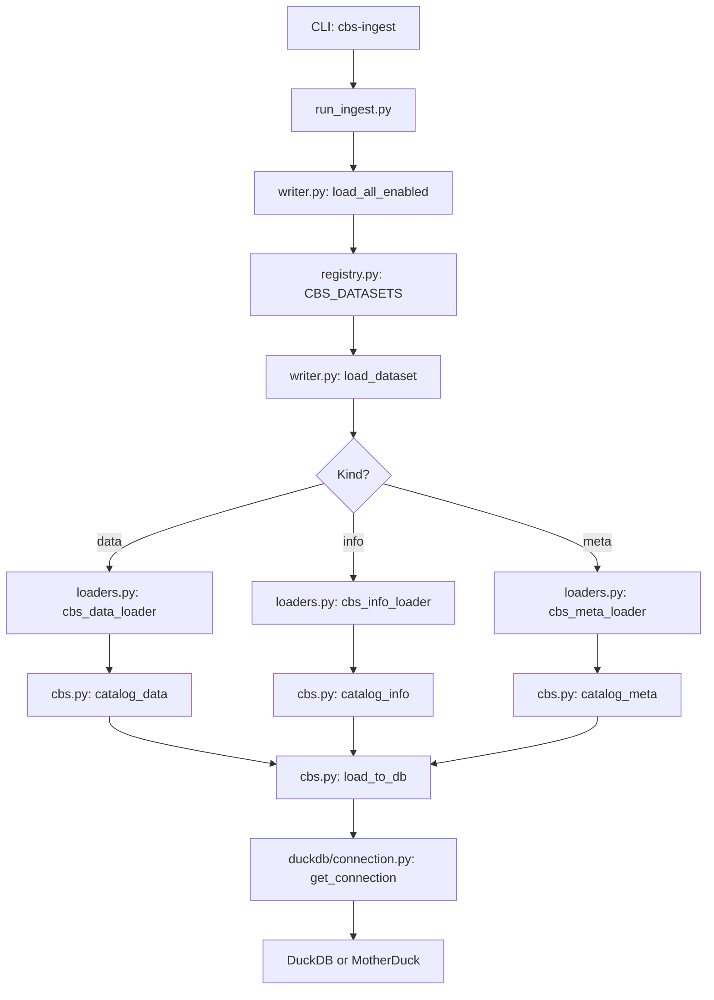

# Ingestion Module for CBS (Dutch Central Bureau of Statistics) data

Extracts and loads CBS datasets into DuckDB (local) or MotherDuck (cloud) for use in the Conversational Analytics POC. 

---

## Overview

This module provides a **Python CLI tool** (`cbs_ingestion`) to ingest data from different resources into a data warehouse. 

It supports: 
- **All kinds of CBS databsets**: Haltjongeren, veelplegers and verdachten have been added, but can be expanded by adding CBS tables to `registry.py`. 
- **Three data types per dataset**: 
    - `data` - The actual data from the CBS
    - `info` - The table information of the dataset (title, description, period)
    - `meta` - Metadata about the dataset, such as detailed field definitions
- **Two environments**:
    - `dev` - A local DuckDB file, in this case `data/duckdb/warehouse.duckdb`
    - `prod` - A MotherDuck database in the cloud

## Structure

```
ingestion/
├── cbs_ingestion/          
│       ├── cbs.py           # CBS data import functions (catalog_data, catalog_info, catalog_meta)
│       ├── dataset_types.py # Type definitions (DatasetKind, WriteMode)
│       ├── loaders.py       # Data loaders for each type (data, info, meta)
│       ├── registry.py      # Dataset configuration (CBS_DATASETS)
│       ├── run_ingest.py    # CLI entry point, use to run ingestion
│       └── writer.py        # Orchestrates dataset loading
├── duckdb/
│   │   └── connection.py    # DB connection logic (DuckDB / MotherDuck)
└── README.md               # This file
```

## Set-up

### Install the package 

### Set Environment Variables 

Create a `.env` file in this directory and set up the following variables: 

```env
MOTHERDUCK_TOKEN=your_motherduck_token
MOTHERDUCK_DB=pocca
```

## Usage

**Run the ingestion CLI**

```bash
# List all available datasets
pocca-ingest --list

# Load all enables datasets to DEV (local DuckDB)
pocca-ingest --db dev

# Load all enabled datasets to PROD (MotherDuck)
pocca-ingest --db prod
```

## Available Datasets

All datasets are defined in `registry.py`. 
Currently supported: 
| Dataset Key | Table ID | Table Name | Type | Schema | Source URL |
| --- | --- | --- | --- | --- | --- |
| haltjongeren_data | 85993NED | cbs_data_haltjongeren | data | raw | – |
| haltjongeren_info | 85993NED | cbs_info_haltjongeren | info | raw | – |
| haltjongeren_meta | 85993NED | cbs_meta_haltjongeren | meta | raw | – |
| veelplegers_data | 85657NED | cbs_data_veelplegers | data | raw | – |
| veelplegers_info | 85657NED | cbs_info_veelplegers | info | raw | – |
| veelplegers_meta | 85657NED | cbs_meta_veelplegers | meta | raw | – |
| verdachten_data | 20366NED | cbs_data_verdachten | data | raw | dataderden.cbs.nl |
| verdachten_info | 20366NED | cbs_info_verdachten | info | raw | dataderden.cbs.nl |
| verdachten_meta | 20366NED | cbs_meta_verdachten | meta | raw | dataderden.cbs.nl |

To add a new dataset, edit `CBS_DATASETS` in `registry.py`. 

## How It Works



### Step By Step

1. CLI Parsing: run_ingest handles --list and --db args. 
2. Dataset Discovery: Reads logged and selected datasources from `registry.py`. 
3. Loading: For each selected dataset: 
    - Fetch data from CBS via `cbsodata` library
    - Add `vernieuwd_op` (refresh timestamp)
    - Write to target DB using DuckDB / MotherDuck connection
4. Connection: Uses `get_connection(env)` to switch between local and prod. 

## Configuration 

### Dataset

Each dataset in `registry.py` is a dataclass with: 

| Field | Type | Required | Default | Description |
| --- | --- | --- | --- | --- |
| key | str | ✅ | – | Unique identifier |
| table_id | str | ✅ | – | CBS table ID (e.g., 85993NED) |
| table_name | str | ✅ | – | Target table name in DB |
| cat_url | str | ❌ | None | Custom CBS catalog URL (e.g., dataderden.cbs.nl) |
| kind | DatasetKind | ❌ | None | Type: "data", "info", or "meta" |
| target_schema | str | ❌ | None | DB schema (default: "raw") |
| write_mode | WriteMode | ❌ | "append" | "append", "replace", or "fail" |
| enabled | bool | ❌ | True | Whether to load by default |
| description | str | ❌ | None | Description of the datasource |

### Environment Variables 

| Variable | Required | Description |
| --- | --- | --- |
| MOTHERDUCK_TOKEN | Only for --db "prod" | API token for MotherDuck database |
| MOTHERDUCK_DB | ❌ | Database name (default: "pocca") |

## Notes & Limitations 

- **CBS_API**: Uses [`cbsodata`](https://pypi.org/project/cbsodata/) Python package.
- **Rate Limits**: Overusage of `cbsodata` might result in rate limits. Consider adding retries or delays. 
- **Schema**: All data is by default written to the `raw` schema. 
- **Refresh**: Each load adds a `vernieuwd_op` column with UTC timestamp. 
- **Replacing**: `write_mode = "replace"` makes sure that the data is refreshed on each run.  

> **Prod vs. Dev**: The prod environment requires `MOTHERDUCK_TOKEN`. Dev uses a local duckdb warehouse located at `../../../data/duckdb/warehouse.duckdb`. 
