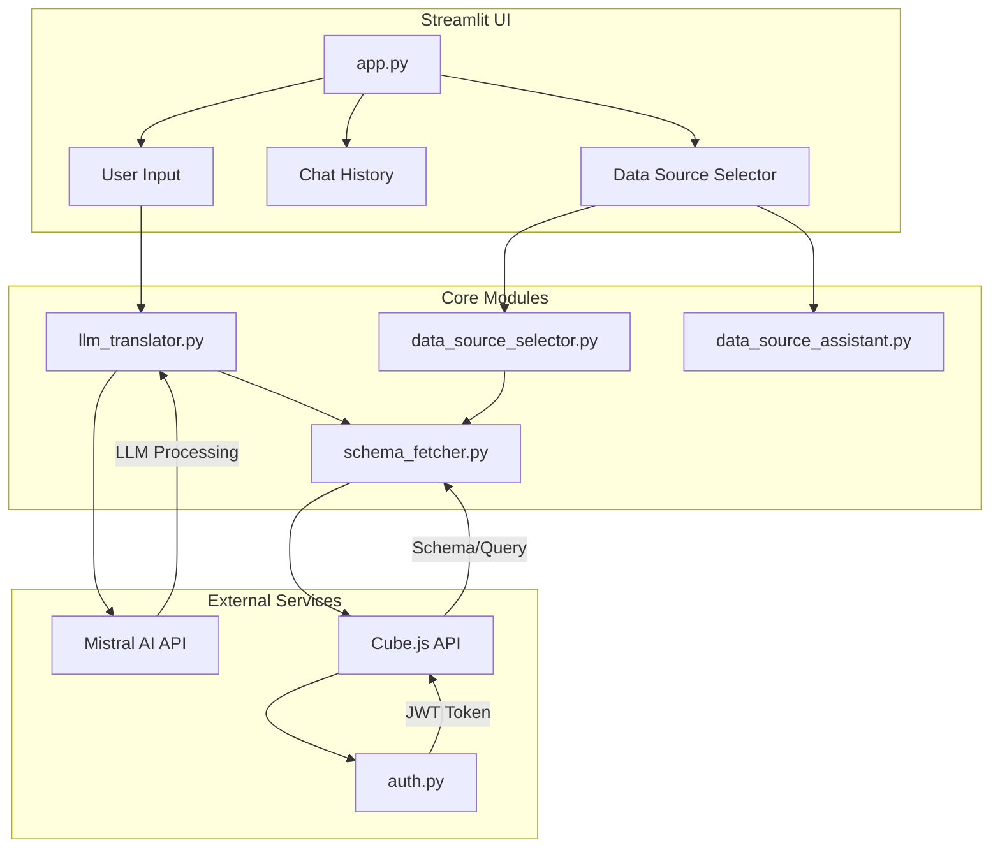

# Conversational Analytics Chatbot

**Streamlit interface for natural language querying of Cube.js semantic layer**

---

## Overview

This chatbot enables users to interact with Cube.js data sources using natural language. It provides two main workflows:

1. **Data Source Discovery**: Users describe what data they are looking for, and the system suggests matching Cube.js cubes
2. **Natural Language Querying**: Once a cube is selected, users can ask questions in plain language to retrieve data

The system uses Mistral AI for intent classification and query translation, mapping natural language questions to Cube.js query JSON.

---

## Features

- **Intelligent Data Source Matching**: Uses LLM to match user descriptions to available cubes
- **Intent Classification**: Distinguishes between metadata questions ("What is X?") and data queries ("How many Y?")
- **Query Translation**: Converts natural language to valid Cube.js query JSON
- **Schema-Aware**: Dynamically fetches cube schemas to generate accurate queries
- **Contextual Answers**: Provides metadata explanations from cube descriptions
- **Interactive UI**: Streamlit-based interface with conversation history

---

## Architecture



---

## Components

| File | Purpose |
|------|---------|
| `app.py` | Main Streamlit application, handles UI and session state |
| `auth.py` | JWT token generation for Cube.js API authentication |
| `cube_client.py` | Executes queries against Cube.js API |
| `data_source_assistant.py` | Manages data source selection UI and LLM matching |
| `data_source_selector.py` | Discovers and describes available Cube.js cubes |
| `llm_translator.py` | Classifies intent and translates NL to Cube.js queries |
| `query_normaliser.py` | Normalizes year inputs and date filters |
| `schema_fetcher.py` | Retrieves cube schemas from Cube.js API |

---

## Setup

### Prerequisites

- Python 3.10+
- Cube.js instance (local or remote)
- Mistral AI API key

### Installation

```bash
# Create virtual environment
python -m venv .venv
source .venv/bin/activate  # On Windows: .\.venv\Scripts\activate

# Install dependencies
pip install -r requirements.txt
```

### Configuration

Create a `.env` file with the following variables:

```bash
# Required
MISTRAL_API_KEY=your_mistral_api_key
CUBEJS_API_SECRET=your_cubejs_api_secret

# Optional
CUBE_API_URL=https://your-cube-instance.com/cubejs-api/v1
CUBE_NAME=default_cube_name
```

### Running the App

```bash
streamlit run app.py
```

The application will be available at `http://localhost:8501`.

---

## Usage

1. **Start the application**: Run `streamlit run app.py`
2. **Describe your data need**: Enter what you are looking for (e.g., "I want data about youth suspects")
3. **Select a data source**: The system will suggest matching cubes; confirm your selection
4. **Ask questions**: Query the selected cube using natural language (e.g., "How many records in 2023?" or "What is the halt_jongeren measure?")

### Example Queries

- Metadata: "What does the delictgroep column mean?"
- Data: "How many Haltjongeren were there in 2023?"
- Aggregation: "Give me a count by year and delictgroep"
- Filtering: "Show me records where jaar is 2023 and geslacht is M"

---

## Technical Details

### Intent Classification

The system classifies each query as either:
- **metadata**: Questions about definitions, column meanings, or schema context
- **data**: Requests for actual data counts, totals, or aggregations

### Query Generation

For data queries:
1. Fetch the cube schema
2. Generate a Cube.js query JSON using LLM
3. Validate and fix time dimension filters
4. Execute against Cube.js API
5. Display results with generated query for transparency

### Data Source Matching

When a user describes their data need:
1. Fetch all available cubes from Cube.js
2. Get descriptions for each cube
3. Use LLM to match user description to cubes
4. Present top matches with reasoning
5. Allow user to select or search manually

---

## Dependencies

- streamlit: Web UI framework
- requests: HTTP client for API calls
- mistralai: Mistral AI Python client
- python-dotenv: Environment variable loading
- pyjwt: JWT token generation

---

## Notes

- This is a proof of concept demonstrating conversational analytics with free/open-source tools
- For production use, consider adding: error handling, rate limiting, query caching, and input validation
- The Cube.js instance must have the appropriate cubes and schemas defined
